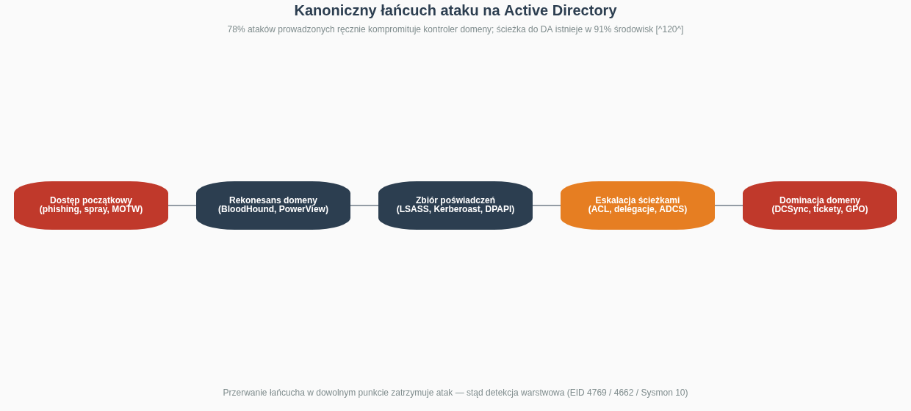
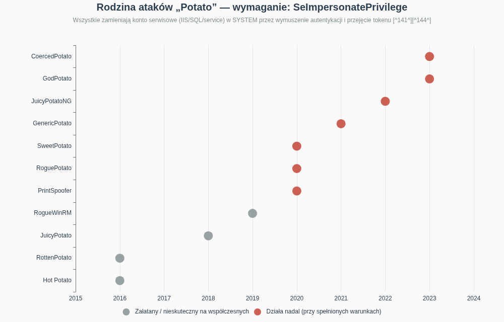
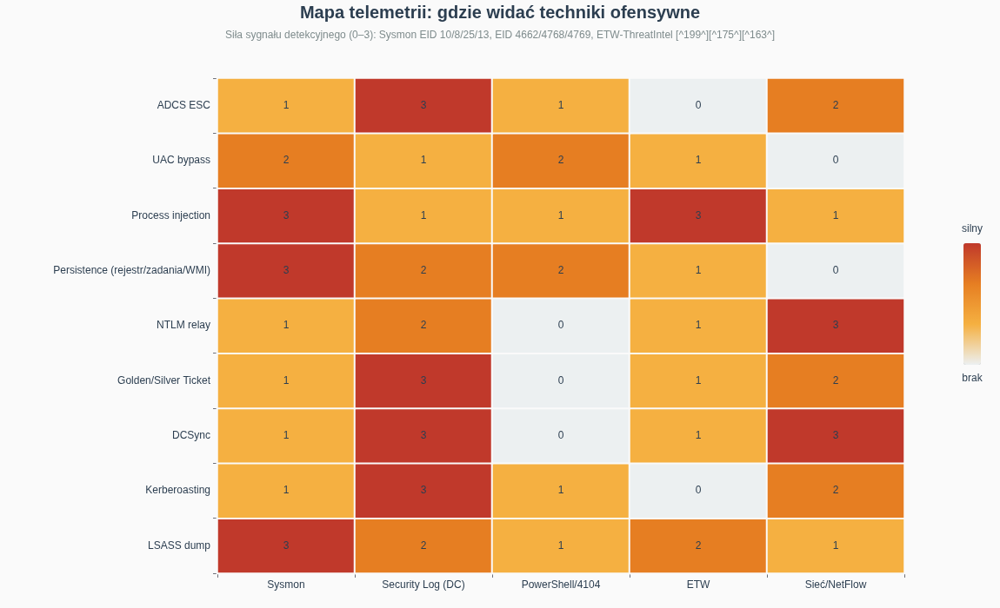
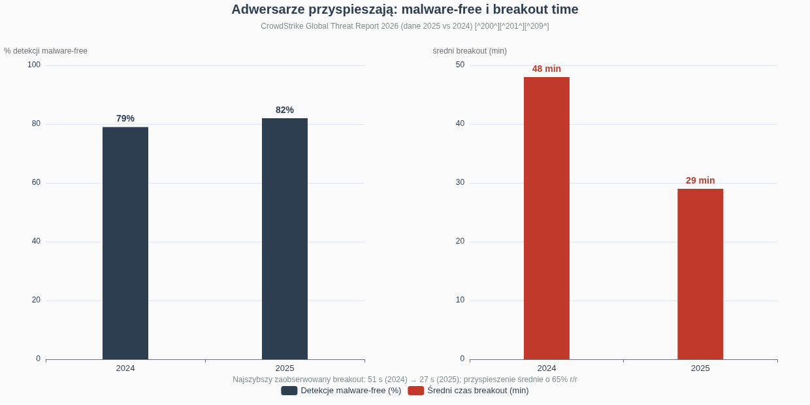

# Red Team na Windows — kompendium wiedzy ofensywnej i detekcyjnej

*Stan na sierpień 2026 r. Dokument researchowy: metodologia, techniki, narzędzia, infrastruktura i kontrapunkt detekcyjny. Wydanie siostrzane do „Red Team na Linuksie — kompendium wiedzy ofensywnej i detekcyjnej".*

---

## Streszczenie wykonawcze

Niniejsze kompendium porządkuje kompletną ścieżkę operacji ofensywnej (red team) w środowiskach Windows i Active Directory — od rekonesansu i dostępu początkowego, przez enumerację hosta i domeny, eskalację uprawnień, utrwalanie dostępu, unikanie detekcji na endpointcie, pozyskiwanie poświadczeń, ruch boczny, aż po dominację domeny, infrastrukturę Command & Control i działania na celu. Dokument jest siostrzaną edycją kompendium linuksowego i zachowuje jego architekturę: każdy etap jest zmapowany na taktyki MITRE ATT&CK i opatrzony kontrapunktem detekcyjnym, ponieważ operacja red team jest oceniana przez to, czy obrona potrafiła ją wykryć — nie przez samo osiągnięcie celu [^124^]. Uwzględnia najświeższy stan wiedzy: rodzinę ataków Potato wraz z wariantami działającymi na w pełni załatanych systemach oraz techniki unikania EDR od direct syscalls po BYOVD [^144^][^164^]. Obok nich omawia współczesne odsłony NTLM relay (CVE-2025-33073), eksploatację AD CS (ESC1–ESC8) i telemetrię detekcyjną opartą o Sysmon, Security Log i ETW [^184^][^186^].

Kluczowe wnioski syntetyczne. Po pierwsze, **Windows to przede wszystkim gra o tożsamość**: Active Directory jest centralnym systemem uwierzytelniania większości organizacji, a jego kompromitacja oznacza kompromitację całego przedsiębiorstwa [^127^]. Microsoft raportuje, że 78% ataków prowadzonych ręcznie kończy się kompromitacją kontrolera domeny, a badania Akamai pokazują, że w 91% badanych środowisk zwykli użytkownicy mają już dziś wystarczające uprawnienia, by eskalować się do Domain Admina [^120^]. Po drugie, **atakujący nie „włamują się" — logują się**: 82% detekcji w 2025 roku było malware-free, a średni czas breakout spadł do 29 minut (najszybszy: 27 sekund), co oznacza, że klasyczna detekcja sygnaturowa jest strukturalnie spóźniona [^200^]. Po trzecie, **eskalacja na hoście Windows to przeważnie błędna konfiguracja, nie exploit**: SeImpersonatePrivilege na kontach serwisowych, usługi ze słabymi ACL, ścieżki bez cudzysłowów i DLL-e ładowane z zapisywalnych katalogów dominują nad błędami jądra [^141^][^152^]. Po czwarte, **detekcja jest możliwa i dobrze udokumentowana**: Event ID 4662 z GUID-ami replikacji wykrywa DCSync, a 4769 z szyfrowaniem RC4 — Kerberoasting [^175^][^180^]. Sysmon Event ID 10 rejestruje dostęp do pamięci LSASS — problem nie leży w braku sygnałów, lecz w tym, że większość organizacji ich nie zbiera [^190^].

---

## Zastrzeżenie prawne i etyczne

Wszystkie techniki opisane w tym dokumencie służą wyłącznie celom edukacyjnym, autoryzowanym testom bezpieczeństwa i budowaniu detekcji. Uruchamianie narzędzi ofensywnych na systemach bez wyraźnej, pisemnej zgody właściciela stanowi przestępstwo (w Polsce m.in. art. 267–269 Kodeksu karnego). Profesjonalne operacje red team odbywają się w ramach formalnych Rules of Engagement definiujących zakres, dozwolone techniki, ramy czasowe i procedury dekonfliktacji [^124^]. Szczególna uwaga dotyczy technik destrukcyjnych lub trudnych w wycofaniu (zmiany ACL w domenie, RBCD, shadow credentials): praktyka operatorska podkreśla obowiązek pełnego cleanupu — usunięcia kont maszynowych, czyszczenia atrybutów delegacji, wycofania wpisów [^126^]. Autor nie ponosi odpowiedzialności za nadużycia.

---

## 1. Fundamenty operacji Red Team na Windows

### 1.1 Dlaczego Windows i AD to osobna dyscyplina

Operacja red team w środowisku Windows różni się od linuksowej fundamentalnie: celem strategicznym jest niemal zawsze **Active Directory**, centralny system tożsamości przedsiębiorstwa, którego przejęcie daje kontrolę nad wszystkimi użytkownikami, systemami i danymi [^127^]. Konsekwencja praktyczna jest taka, że duża część tradecraft windowsowego nie dotyczy exploitów, lecz nadużywania legalnych mechanizmów uwierzytelniania (Kerberos, NTLM), relacji zaufania i błędnych konfiguracji katalogu — a CrowdStrike potwierdza to makroskopowo: 82% detekcji w 2025 roku dotyczyło aktywności malware-free, prowadzonej ważnymi poświadczeniami i zaufanymi przepływami tożsamości [^200^]. Dlatego MITRE ATT&CK wprowadza tu wspólny język: ponad 200 technik i setki sub-technik Enterprise, z taktyką Defense Evasion wśród najczęściej obserwowanych w realnych intruzjach [^121^][^125^].

Druga cecha odróżniająca to szybkość. Średni czas breakout (od dostępu początkowego do ruchu bocznego) spadł w 2025 roku do **29 minut** — o 65% szybciej niż rok wcześniej — a najszybszy zaobserwowany wyniósł 27 sekund [^200^]. Dla operatora oznacza to presję na przygotowanie: enumeracja domeny, zbiory poświadczeń i ruch boczny muszą być przećwiczone do poziomu odruchu. Dla obrońcy — że okno reakcji mierzy się w minutach, więc detekcja musi być zautomatyzowana, a nie analityczna [^201^].

### 1.2 Kanoniczny łańcuch ataku na Active Directory

Realistyczny łańcuch ataku na AD ma pięć faz: **punkt oparcia** (phishing, password spraying, podatność), **rekonesans domeny** (mapowanie relacji BloodHoundem), **zbiór poświadczeń** (LSASS, Kerberoasting, DPAPI), **eskalacja ścieżkami ataku** (ACL, delegacje, AD CS) i **dominacja domeny** (DCSync, fałszerstwo ticketów, GPO) [^120^]. Modelowy przykład z 2025 roku: grupa Scattered Spider zadzwoniła na helpdesk Marks & Spencer, podając się za pracownika, i przekonała konsultanta do zresetowania poświadczeń — z tego pojedynczego punktu oparcia przeszła pełnym łańcuchem aż do kradzieży całej bazy AD; sprzedaż online nie działała pięć dni, a kurs akcji spadł o ponad 500 mln funtów [^120^]. Punkt wejścia nie był zero-dayem — był nim telefon i podręcznikowa ścieżka ataku [^120^].

Kluczowa konsekwencja metodologiczna: atakujący podąża przewidywalną ścieżką rekonesans → enumeracja → poświadczenia → eskalacja, a przerwanie łańcucha w dowolnym punkcie zatrzymuje atak [^118^]. To dlatego taktyka „assume breach" i detekcja warstwowa — na poświadczeniach, na replikacji, na ticketach — jest skuteczniejsza niż utwardzanie samego obwodu. Najczęstszym punktem oparcia nie są exploity, lecz ważne poświadczenia i zaufane przepływy tożsamości [^200^].

### 1.3 OPSEC na endpointcie Windows: MOTW, AMSI, EDR

Operator na Windows pracuje w najbardziej instrumnetowanym ekosystemie świata: AMSI skanuje skrypty przed wykonaniem, ETW dostarcza telemetrię behawioralną, Defender i EDR hookują API userland, a Sysmon (jeśli wdrożony) widzi procesy, sieć, rejestr i dostęp do pamięci [^163^][^199^]. Już na etapie dostarczania payloadu działa **Mark of the Web** — identyfikator strefy (Zone.Identifier) dołączany do plików z przeglądarki/poczty, który wyzwala Protected View i blokady makr; operacyjne obejścia obejmują pliki z lokalizacji zaufanych, udziały wewnętrzne (pliki lokalne nie mają MOTW), formaty nieoznaczane MOTW (historycznie OneNote, ISO, VHD) czy HTML smuggling [^130^]. Profesjonalny kurs operatorski (np. SANS SEC665) uczy dostępu początkowego przez nadużycie formatów plików, DLL side-loading, podpisane payloady i AiTM phishing omijający MFA przez kradzież sesji — zawsze z analizą kompromisów detekcyjnych [^123^].

Zasada nadrzędna OPSEC pozostaje identyczna jak w świecie linuksowym: minimalizacja śladu (egzekucja w pamięci, BOF-y zamiast fork&run, unikanie zapisu na dysk), segregacja infrastruktury, wolne tempo oraz świadomość, że każde narzędzie ma profil detekcyjny — WinPEAS jest „głośny, ale kompletny", Seatbelt daje lepszy OPSEC, a ingest SharpHounda generuje rozpoznawalny wzorzec zapytań LDAP i RPC [^132^][^140^]. Operator wybiera narzędzie pod profil obrony celu, nie pod wygodę.

---

## 2. Rekonesans i dostęp początkowy (TA0043, TA0001)

### 2.1 Rekonesans zewnętrzny i wstępna enumeracja domeny

Rekonesans zewnętrzny obejmuje OSINT (rejestry domen, certyfikaty, Google dorks, media społecznościowe, wycieki poświadczeń) oraz mapowanie powierzchni: VPN-y, bramy RDP, panele webowe, usługi pocztowe [^126^]. Po stronie wewnętrznej, jeszcze przed zdobyciem poświadczeń, operator identyfikuje domenę i kontrolery przez DNS (`nslookup -type=SRV _ldap._tcp.dc._msdcs.target.local`), enumeruje udziały SMB anonimowo i skanuje porty LDAP/Kerberos — samo to często ujawnia topologię i nazewnictwo hostów [^126^]. Password spraying na usługach wystawionych na zewnątrz (OWA, VPN, Entra ID) pozostaje jednym z najskuteczniejszych wektorów — pojedyncze hasło typu „Sezon2026!" testowane przeciwko wszystkim kontom omija polityki blokad, które zatrzymałyby brute force [^126^].

Z ważnym kontem domenowym — nawet najniżej uprzywilejowanym — powierzchnia enumeracji otwiera się dramatycznie: domyślnie wszyscy uwierzytelnieni użytkownicy mogą odpytywać LDAP o niemal całą zawartość katalogu, łącznie z użytkownikami, grupami, komputerami, ACL-ami i relacjami zaufania [^131^][^133^]. To fundamentalna asymetria AD: katalog jest czytelny dla każdego, a uprawnień nie da się w praktyce rzetelnie audytować ręcznie — można więc ścieżki ataku tylko usuwać, nie „ukrywać" [^122^].

### 2.2 Wektory initial access: phishing, dokumenty, HTML smuggling

Dominującym wektorem dostępu początkowego pozostaje phishing z payloadem wykonywalnym: makra VBA, zdalna iniekcja szablonów (remote template injection), HTML smuggling (składanie pliku po stronie przeglądarki, poza inspekcją proxy), pliki skrótów i archiwa omijające MOTW [^130^]. CrowdStrike notuje eksplozję podsekcji socjotechnicznej: 563% wzrost incydentów z fałszywymi CAPTCHA (ClickFix — ofiara sama wkleja złośliwe polecenie PowerShell) i 141% wzrost spamu [^200^]. W kampanii wykrytej przez Fortinet zmodyfikowanego agenta Havoc Demon dostarczano właśnie socjotechniką, a C2 tunelowano przez Microsoft Graph API i SharePoint — legalne usługi jako kanał kontroli [^219^].

Dostęp przez podatności i brokery dostępu stanowi równoległy nurt: 42% wzrost zero-dayów eksploatowanych przed publikacją, systematyczne celowanie w urządzenia brzegowe (VPN, firewalle) oraz rynek access brokerów sprzedających gotowe footholdy operatorom ransomware [^200^][^209^]. Z punktu widzenia planowania operacji red team wektor initial access dobiera się do profilu przeciwnika, którego się emuluje — i do ROE, które określa, czy socjotechnika jest w zakresie [^124^].

---

## 3. Enumeracja po kompromitacji (TA0007)

### 3.1 Enumeracja hosta: WinPEAS, Seatbelt, PowerUp

Na pojedynczym hoście checklista privesc jest dobrze zindustrializowana: **WinPEAS** (z rodziny PEASS-ng) wykonuje szeroki audyt — poświadczenia w rejestrze i plikach, uprawnienia usług, zadania harmonogramu, instalatory MSI, brakujące patche — kolorując wyniki według prawdopodobieństwa eksploatacji [^136^][^132^]. **Seatbelt** (GhostPack) robi pogłębiony „security survey" hosta: ustawienia obronne, tokeny, UAC, LAPS, Credential Guard, zalogowani użytkownicy, ciekawe pliki — i jest preferowany w operacjach covert, bo jest cichszy niż WinPEAS [^132^]. **PowerUp/SharpUp** celują w konkretne błędy usług (binpath, ACL, unquoted paths) z funkcjami automatycznego uzbrojenia, a **Watson/Sherlock** dopasowują brakujące hotfixy do publicznych exploitów jądra [^152^][^132^]. Rekomendowany przepływ pracy: WinPEAS dla szerokiego rozpoznania → Watson dla kernela → Seatbelt dla ukierunkowanych kontroli → PowerUp tam, gdzie znaleziono wektor [^132^].

Ręczne checki pozostają kanonem, bo każda automatyzacja ma sygnaturę: `whoami /priv` (SeImpersonate? SeDebug?), `wmic service get name,pathname,startmode` z filtrami na ścieżki bez cudzysłowów, `accesschk.exe -uwcqv "Authenticated Users" *` na uprawnienia usług, `icacls` na binaria usług, zapytania rejestru o AlwaysInstallElevated i AutoRuny, `schtasks /query /fo LIST /v`, `cmdkey /list`, `findstr /si password *.txt *.ini *.config` oraz przegląd plików unattend [^152^]. Wartościowe są też pliki Polityki Grup z hasłami (historyczny cpassword w GPP), skrypty logowania na SYSVOL i udziały z plikami konfiguracyjnymi [^128^].

### 3.2 Enumeracja domeny: PowerView i natywne moduły

**PowerView** (PowerSploit) to standard enumeracji AD z poziomu zwykłego użytkownika — nie wymaga uprawnień administracyjnych ani instalacji RSAT, bo korzysta z hooków AD PowerShella i Win32 API [^134^][^133^]. Kanoniczny zestaw: `Get-NetDomain`/`Get-NetForest` (granice środowiska), `Get-NetDomainController` (cele wysokiej wartości), `Get-NetUser` z filtrowaniem po `pwdlastset`, SPN (`Get-NetUser -SPN` → kandydaci do Kerberoasting), `Get-DomainGroupMember "Domain Admins" -Recurse`, `Invoke-ShareFinder` i `Find-InterestingDomainShareFile` (udziały z sekretami), `Get-ObjectAcl` (niebezpieczne prawa: GenericAll, GenericWrite, WriteDacl, WriteOwner, ForceChangePassword), `Get-DomainTrustMapping` (mapa zaufania) oraz `Find-LocalAdminAccess` i `Test-AdminAccess` (gdzie mam admina) [^138^][^135^]. Poszukiwanie haseł w polu Description (`Find-UserField -SearchField Description -SearchTerm "pass"`) to klasyk, który wciąż przynosi efekty [^137^].

OPSEC enumeracji domenowej to gra o wzorzec zapytań: masowe zapytania LDAP o nietypowych filtrach, rekurencyjne rozwiązywanie grup i skanowanie sesji po wszystkich hostach tworzą sygnaturę wykrywalną dla rozwiązań identity detection i dobrych reguł SIEM (nagły wzrost zapytań katalogowych z jednego konta) [^120^][^140^]. Operator zważa tempo, używa atrybutów docelowych zamiast `-Properties *` i preferuje kolektory jednoprzebiegowe.

### 3.3 BloodHound i SharpHound: graf jako mapa operacji

**BloodHound** zamienia surową enumerację w graf relacji — użytkownicy, grupy, komputery, GPO, sesje i ACL-e jako węzły i krawędzie — i odpowiada na pytanie, którego żadna płaska lista nie udzieli: jaka jest **najkrótsza ścieżka od mojego konta do Domain Admina** [^118^][^119^]. Kolektor **SharpHound** (C#, warianty PowerShell/Python/Rust) zbiera dane podpisanymi zapytaniami LDAP do DC oraz RPC/SMB do hostów (grupy lokalne, sesje) — w trybie `-c All`, do uruchomienia w pamięci z implantu [^131^][^140^]. Predefiniowane zapytania, od których zaczyna się każdą operację: Shortest Paths to Domain Admins, Principals with DCSync Rights, AS-REP Roastable Users, Kerberoastable Members of High Value Groups oraz Shortest Paths from Owned Principals [^119^].

BloodHound jest równie cenną bronią obrońców. SpecterOps pokazuje, że nawet „małe" środowisko z tysiącem endpointów ma zwykle miliony ścieżek ataku — naprawianie pojedynczej ścieżki wskazanej w raporcie red teamu przypomina zatem zamykanie jednej uliczki na trasie z Seattle do Nowego Jorku; skuteczne jest tylko systemowe zarządzanie ścieżkami (Attack Path Management) i usuwanie węzłów o największej przepustowości [^122^]. Typowe naprawy: usunięcie zbędnego zagnieżdżania grup w DA, audyt ACL-i (GenericAll/WriteDacl/WriteOwner bez uzasadnienia), wyłączenie delegacji nieograniczonej, tiering administracyjny, LAPS i korekta flag DONT_REQ_PREAUTH [^119^]. Detekcja samego SharpHounda to osobny temat: charakterystyczny wzorzec LDAP+RPC+SMB zakończony wyeksportowaniem ZIP-a jest rozpoznawalny — stąd w operacjach covert stosuje się zbieranie rozciągnięte w czasie lub ograniczone metody [^140^].

| Narzędzie | Warstwa | Uprawnienia | Kluczowa zaleta | Sygnatura detekcyjna |
|---|---|---|---|---|
| WinPEAS | host | użytkownik | setki kontroli, priorytetyzacja [^136^] | głośna, serie odczytów rejestru/usług [^132^] |
| Seatbelt | host | użytkownik | survey postawy obronnej, lepszy OPSEC [^132^] | umiarkowana |
| PowerUp/SharpUp | host | użytkownik | auto-eksploatacja błędów usług [^152^] | AMSI (PowerShell), znane sygnatury |
| Watson | host | użytkownik | dopasowanie CVE do buildu [^132^] | niska |
| PowerView | domena | użytkownik domenowy | pełna enumeracja AD bez RSAT [^134^] | wzorce LDAP, AMSI |
| SharpHound | domena | użytkownik domenowy | graf ścieżek ataku [^131^] | LDAP+RPC+SMB+ZIP [^140^] |
| NetExec (nxc) | sieć | zależnie | spray, walidacja Pwn3d!, moduły [^118^] | wzorce SMB/RPC, logony sieciowe |

---

## 4. Eskalacja uprawnień (TA0004)

### 4.1 Rodzina Potato: SeImpersonatePrivilege jako krótka droga do SYSTEM

Przywilej **SeImpersonatePrivilege** — domyślnie przydzielany kontom usługowym (IIS, MSSQL i pochodne) — pozwala procesowi podszywać się pod klienta; rodzina ataków Potato zamienia ten mechanizm w pełną eskalację, zmuszając wysoce uprzywilejowany komponent (usługa RPC/DCOM, EFSRPC, Print Spooler) do uwierzytelnienia się do sfałszowanego punktu końcowego, po czym przechwytuje i podszywa się pod jego token SYSTEM [^141^][^144^]. Ewolucja rodziny to historia wyścigu zbrojeń: HotPotato (2016) przez NTLM relay z HTTP na SMB, Rotten/JuicyPotato z abstrakcją RPC CLSID, RoguePotato z OXID resolver na alternatywnym porcie, PrintSpoofer przez Print Spooler, SweetPotato jako unifikacja, GodPotato na Server 2012–2022, a kolejne warianty (LocalPotato, EfsPotato, RemotePotato) eksplorują nowe interfejsy wymuszania uwierzytelnienia [^141^]. Najnowsze odsłony (linia CoercedPotato) demonstrowano na w pełni załatanych wówczas Windows 11 i Server 2025 — potwierdzając, że „selekcja Potato" pozostaje aktualnym ćwiczeniem operatorskim [^144^].

Detekcja: nietypowe procesy-dzieci usług (cmd/powershell jako dziecko `spoolsv.exe`, `svchost.exe`), tworzenie tokenów przez konta usługowe, zdarzenia tworzenia usługi (7045) tuż po uwierzytelnieniach z konta IIS/MSSQL [^141^]. Środki zaradcze obejmują wyłączanie zbędnych usług wymuszania (Print Spooler na serwerach bez druku), ograniczanie kont z SeImpersonate/SeAssignPrimaryToken i aktualizacje systemowe łatające kolejne warianty [^144^].

### 4.2 Błędne konfiguracje usług, rejestru i instalatorów

Najpowszechniejsza praktyczna oś eskalacji to **usługi Windows**: gdy zwykły użytkownik ma prawa modyfikacji do konfiguracji usługi (SERVICE_CHANGE_CONFIG przez `sc config binpath=`) lub do jej binarki (FILE_WRITE_DATA w katalogu usługi), restart usługi uruchamia kod atakującego jako SYSTEM [^152^]. Wariant **unquoted service path** wykorzystuje fakt, że ścieżka `C:\Program Files\App Name\service.exe` bez cudzysłowów jest rozwiązywana iteracyjnie — wystarczy upuścić złośliwe `App.exe` do `C:\Program Files\`, jeśli katalog jest zapisywalny [^152^]. Analogiczne efekty daje DLL hijacking w zapisywalnych katalogach aplikacji działających jako SYSTEM oraz nadpisywanie binarek zadań harmonogramu [^158^].

W rejestrze kluczowe są: **AlwaysInstallElevated** (oba klucze HKLM i HKCU ustawione na 1 → dowolny MSI instalowany jako SYSTEM, uzbrajany np. przez `msfvenom -f msi` lub `msiexec /i`), AutoRuny wskazujące zapisywalne pliki, klucze Image File Execution Options z zapisywalnymi Debuggerami oraz poświadczenia w kluczach typu `HKLM\SOFTWARE\Microsoft\Windows NT\CurrentVersion\Winlogon` (AutoAdminLogon) [^152^]. Zadania harmonogramu, udziały z binariami usług, pliki unattend z hasłami, zapamiętane poświadczenia (`cmdkey /list`) i katalogi instalatorów dopełniają checklistę [^152^].

### 4.3 Obejścia UAC i exploity jądra

**UAC nie jest granicą bezpieczeństwa** — to mechanizm wygody — ale jej obejście jest krokiem wymaganym w drodze z medium integrity do high/system: katalog UACME utrzymuje dziesiątki metod, z których najbardziej znane to fodhelper/eventvwr (hijack kluczy HKCU `ms-settings`), autoelevating COM (CMSTPLUA), DLL side-loading do auto-elewujących binarek systemowych oraz computerdefaults; wszystkie działają z HKCU, więc nie wymagają zapisu do lokalizacji chronionych [^156^][^152^]. Detekcja: Sysmon EID 12/13 (zdarzenia rejestru w ścieżkach `shell\open\command`), uruchomienia autoelewujących binarek z nietypowych katalogów, relacje rodzic-dziecko (fodhelper → cmd) [^199^][^202^].

Exploity jądra to ostateczność — głośne, ryzykowne dla stabilności, lecz skuteczne, gdy cel jest niezałatany: dopasowanie przez `systeminfo` i Watson/Sherlock [^152^]. Aktualny krajobraz to m.in. **CVE-2025-62215** (Windows Kernel, race condition → SYSTEM, trafił do katalogu KEV po eksploatacji in-the-wild i został załatany w listopadowym Patch Tuesday) [^146^][^150^]. Świeże pozycje z 2026 roku to **CVE-2026-40369** (Win32k) i **CVE-2026-24289** — stały strumień EoP-ów jądra utrzymuje presję na okno patchowania [^142^][^143^]. W operacjach red team exploity jądra stosuje się wyjątkowo — preferencja idzie ku błędnym konfiguracjom i nadużyciom tożsamości, bo są cichsze i odtwarzalne [^118^].

---

## 5. Utrwalanie dostępu (TA0003)

### 5.1 Mechanizmy na hoście

Taksonomia persistence na Windowsie jest szeroka: **klucze Run/RunOnce** (HKLM/HKCU, w tym `Winlogon\Userinit`, Image File Execution Options z Debugger), **zadania harmonogramu** (`schtasks /create /sc onlogon`, warianty z najwyższymi uprawnieniami), **usługi** (`sc create` / modyfikacja binpath), **WMI event subscription** (trójka EventFilter→Consumer→Binding, bezplikowa i trudna w audycie), **DLL search order hijacking / COM hijacking** (HKCU nad HKLM w klasach COM) oraz **konta lokalne/backdoorowe** [^160^][^158^]. W domenie dochodzą wektory katalogowe: AdminSDHolder (dziedziczenie złośliwych ACE na chronione grupy), GPO (modyfikacja polityki = wykonanie kodu na setkach hostów), SIDHistory injection oraz szkieletowe klucze (Skeleton Key na DC) [^128^][^120^].

Stealth persistence to osobna sztuka: timestomping binarek, nazwy imitujące komponenty systemowe, legitymne podpisy przez side-loading podpisanych binarek, przechowywanie payloadów w ADS/rejestrze, oraz warianty bezplikowe (WMI, COM) minimalizujące artefakty dyskowe [^160^]. Detekcja opiera się o Sysmon EID 12–14 (rejestr), zdarzenia 7045/4697 (usługi), 4698/4702 (zadania), 5861 (konsumenci WMI), baselining AutoRuns (narzędzie Sysinternals) i okresowe porównania z golden image [^199^][^160^].

### 5.2 Tożsamość jako persistence: tickety Kerberosa

W środowisku AD najtrwalszą formą persistence są **sfabrykowane poświadczenia**: **Golden Ticket** (TGT podpisany skradzionym hashem krbtgt — domyślnie ważny nawet 10 lat, niezależny od DC), **Silver Ticket** (TGS usługi podpisany hashem konta usługowego — nie wymaga kontaktu z DC po wykuwaniu) oraz **Diamond Ticket** (legalnie pozyskany TGT, którego pola są modyfikowane przed ponownym podpisaniem — bardziej spójny kryptograficznie i cichszy niż golden) [^155^][^159^]. Golden Ticket przetrwa nawet zmianę hasła skompromitowanego użytkownika; wymusza podwójny reset hasła krbtgt — dwukrotny, z odstępem na replikację i wygaśnięcie ticketów, bo AD przechowuje dwa ostatnie hashe [^120^].

Detekcja fałszywych ticketów to analiza niespójności: Golden Ticket często łamie rozsądne wartości (okresy ważności, PAC), Silver Ticket nie generuje zdarzeń 4768/4769 na DC (brak wymiany AS/TGS) — widoczne są tylko logony usługowe na hoście docelowym; Diamond Ticket bywa cichszy, bo zachowuje legalny przepływ [^153^][^120^]. Zdarzenia 4769 z nietypowymi kontami, dziesięcioletnie czasy życia ticketów i brakujące kroki protokołu to sygnały, które powinny być w SIEM każdej organizacji monitorującej DC [^157^].

| Mechanizm | Zakres | Trwałość | Kluczowa detekcja |
|---|---|---|---|
| Run keys / IFEO | host | do usunięcia | Sysmon 12–14, AutoRuns diff [^160^] |
| Zadania harmonogramu | host | do usunięcia | 4698/4702, Sysmon 1 (schtasks) [^199^] |
| Usługi | host | do usunięcia | 7045/4697 [^160^] |
| WMI subscription | host | bezplikowa | 5861, audyt root\subscription [^160^] |
| COM/DLL hijack | host | do usunięcia | Sysmon 7/12–14, AppLocker/WDAC [^158^] |
| AdminSDHolder / GPO | domena | dziedziczone | 5136 (zmiany atrybutów), audyt SD [^128^] |
| Golden/Diamond Ticket | domena | do resetu krbtgt ×2 | niespójności 4768/4769/4624 [^154^] |
| Silver Ticket | usługa | do resetu hasła konta | brak 4769 przy logonach usługowych [^159^] |
| Skeleton Key | DC | do restartu/łaty | 7045 na kontrolerze domeny [^120^] |

---

## 6. Unikanie detekcji na endpointcie (TA0005)

### 6.1 AMSI i ETW: oślepianie sensorów

**AMSI** (Antimalware Scan Interface) przechwytuje skrypty PowerShell/JScript/VBA przed wykonaniem i przekazuje je skanerowi; klasyczne obejścia to in-memory patch funkcji `AmsiScanBuffer` w `amsi.dll` (nadpisanie prologu tak, by zwracała AMSI_RESULT_CLEAN), wymuszanie błędów inicjalizacji oraz — coraz częściej — unikanie kodu zarządzanego (BOF-y, natywne PE) zamiast walki z silnikiem skryptowym [^163^][^172^]. **ETW** (Event Tracing for Windows) zasila telemetrię Defendera i EDR; obejścia obejmują patch `EtwEventWrite`, wyłączanie providerów w procesie implantu oraz uruchamianie w procesach, których EDR nie instrumentuje [^164^]. Oba mechanizmy są dziś chronione przez tamper protection i PPL, więc patchowanie jest możliwe przeważnie dopiero po eskalacji lub w obrębie własnego procesu — i samo w sobie generuje telemetrię (podejrzany dostęp do modułów systemowych widzą Sysmon i EDR) [^199^][^164^].

### 6.2 Iniekcje procesów: taksonomia i sygnatury

Taksonomia iniekcji obejmuje: **klasyczną** (OpenProcess→VirtualAllocEx→WriteProcessMemory→CreateRemoteThread), **DLL injection** (LoadLibrary przez remote thread), **process hollowing** (utworzenie zawieszonego procesu, wymiana obrazu, wznowienie), **APC injection** (w tym EarlyBird na zawieszonych wątkach), **AtomBombing** (tablice atomów), **thread execution hijacking** oraz warianty typu **module stomping** i **phantom DLL hollowing** [^162^][^161^]. Każda wariantyzacja to próba uniknięcia reguł Sysmon: **EID 8** (CreateRemoteThread) widzi klasyczne wstrzyknięcia, **EID 10** (ProcessAccess) widzi otwarcie procesu z maskami dostępu do zapisu pamięci — dlatego współczesny tradecraft preferuje syscalls, mapowania sekcji i wczesne fazy życia procesu, gdzie telemetria jest rzadsza [^199^][^171^].

### 6.3 Direct i indirect syscalls: zejście poniżej hooków

EDR-y hookują funkcje `ntdll.dll` w userland, by widzieć wywołania systemowe procesu; odpowiedzią ofensywną są **direct syscalls** — wykonanie instrukcji `syscall` bezpośrednio z pamięci implantu z własnoręcznie ustawionym numerem SSN (SysWhispers i następcy generują stub-y pod konkretną wersję systemu), co omija hooki ntdll [^165^][^170^]. Problem: statyczne SSN-y psują się przy aktualizacjach systemu, a skok do `syscall` spoza ntdll bywa anomalią. **Indirect syscalls** (Hell's Gate, Halo's Gate, Tartarus Gate) rozwiązują to, wyszukując wolny od hooków fragment `syscall; ret` wewnątrz ntdll i skacząc do niego — stos wywołań wygląda wtedy legalnie [^164^][^165^]. Kontrdetekcja EDR to analiza call stacków (telemetria ETW-TI), inspekcja pamięci wątków uśpionych oraz wykrywanie sleep obfuscation (**Ekko**, **FOLIAGE** — szyfrowanie pamięci implantu na czas snu, by zmylić skany pamięci) [^168^][^166^].

### 6.4 BYOVD, BYOI i wyłączanie EDR

Najcięższy krok eskalacyjny tradecraftu to wyłączenie samego sensora: **BYOVD** (Bring Your Own Vulnerable Driver) instaluje legalnie podpisany, lecz podatny sterownik i przez niego z jądra ubija procesy/callbacki EDR — katalog **LOLDrivers** indeksuje setki takich sterowników, a grupy ransomware rutynowo wdrażają dedykowane „EDR killery" [^209^][^168^]. **BYOI** (Bring Your Own Installer) wykorzystuje legalne narzędzia administracyjne — instalatory i agentów zdalnego zarządzania (RMM: AnyDesk, ScreenConnect, Tactical RMM) — jako nośnik trwałego dostępu, bo generują legalny ruch i podpisane binaria [^209^][^213^]. Detekcja: ładowanie sterowników spoza whitelisty (Sysmon EID 6), reguły oparte o katalog LOLDrivers (hashe/sygnatury), alerty na instalację RMM spoza katalogu firmowego oraz monitoring zmian konfiguracji Defendera (EID 5007) i wyłączeń tamper protection [^199^][^209^].

---

## 7. Dostęp do poświadczeń (TA0006)

### 7.1 LSASS i lokalne magazyny sekretów

**LSASS** (`lsass.exe`) trzyma w pamięci sekrety zalogowanych użytkowników (hashe NTLM, tickety Kerberosa, hasła w reversible encryption), więc jego zrzut to najkrótsza droga do rozległego ruchu bocznego: techniki to **Mimikatz** (`sekurlsa::logonpasswords`), zrzut przez legalne narzędzia (**comsvcs.dll**: `rundll32.exe C:\Windows\System32\comsvcs.dll, MiniDump <pid> <path> full`, **procdump**, Task Manager) oraz **nanodump** i pochodne z syscalls omijające hooki [^190^][^196^]. Kontr: **LSA Protection (PPL)** wymusza podpisane pluginy i blokuje dostęp niepodpisanym procesom, a **Credential Guard** (VBS) izoluje sekrety w enklawie hiperwizora [^190^]. Telemetria kanoniczna to Sysmon **EID 10** (ProcessAccess do lsass z charakterystycznymi maskami dostępu), EID 11 (zapis `lsass.dmp`) oraz gotowe reguły detekcyjne na zrzuty pamięci LSASS — z tym że Credential Guard nie chroni ticketów w użyciu ani kont serwisowych poza zakresem izolacji [^195^][^199^]. Obok LSASS: **SAM/SECURITY/SYSTEM** (hashe kont lokalnych, `reg save` lub wolumen cieni), **LSA secrets** (hasła kont usług), **cache logowań domenowych** (MSCASHv2 — nie do PtH, lecz do łamania offline) oraz pamięć menedżerów haseł i przeglądarek [^190^].

### 7.2 Kerberoasting, AS-REP roasting

**Kerberoasting** wykorzystuje fakt, że każdy uwierzytelniony użytkownik może zamówić ticket usługowy (TGS) dla dowolnego konta z SPN — a fragment TGS jest szyfrowany kluczem pochodzącym od hasła konta usługowego, więc da się go łamać offline (Rubeus `kerberoast` → Hashcat `-m 13100` dla RC4) [^180^][^120^]. Enumeracja celów: `Get-NetUser -SPN` (PowerView) lub `GetUserSPNs.py` (Impacket) [^138^]. Detekcja jest dojrzała: **EID 4769** z szyfrowaniem **RC4 (0x17)** tam, gdzie normalnie dominuje AES (0x12), bursty zapytań o wiele SPN-ów z jednego hosta — to jedna z najwyżej sygnalizujących reguł AD, bo narzędzia atakujących celowo zamawiają RC4, szybszy w łamaniu [^120^]. **AS-REP roasting** celuje w konta z flagą DONT_REQ_PREAUTH: odpowiedź AS-REP zawiera dane szyfrowane kluczem użytkownika — łamane offline (`GetNPUsers.py`, Rubeus `asreproast`), a detekcją jest **EID 4768** z pre-authentication type 0 [^120^]. Obrona: długie losowe hasła kont usługowych (gMSA), usuwanie DONT_REQ_PREAUTH, monitoring 4768/4769 [^180^].

### 7.3 DCSync: replikacja jako broń

**DCSync** symuluje kontroler domeny i przez protokół replikacji (MS-DRSR, `DsGetNCChanges`) wyciąga hashe dowolnych kont — w tym krbtgt — bez logowania na DC i bez dumpowania NTDS.dit z dysku [^173^][^175^]. Wymagane prawa to trójka rozszerzonych praw replikacji na obiekcie domeny: **DS-Replication-Get-Changes** (GUID 1131f6aa…), **…-All** (1131f6ad…) oraz opcjonalnie **…-In-Filtered-Set**; domyślnie mają je Administratorzy, Domain Admins, Enterprise Admins i kontrolery domeny — ale przez błędne ACL-e często także konta serwisowe „do backupu AD" [^175^]. Realizacja: `secretsdump.py 'DOMAIN/user:pass@DC' -just-dc` lub `lsadump::dcsync /user:krbtgt` (Mimikatz) [^173^]. Detekcja kanoniczna: **EID 4662** (Directory Service Access) z wymienionymi GUID-ami w polu Properties, generowane przez host, który **nie jest kontrolerem domeny** — reguła o skrajnie niskim poziomie false-positive, bo legalna replikacja zawsze pochodzi z DC [^175^][^120^]. DCSync jest końcowym akordem większości operacji: z hashem krbtgt operator wykuwa Golden Tickety [^154^].

### 7.4 DPAPI i „sekrety na stacji"

**DPAPI** szyfruje sekrety kluczem wyprowadzonym z hasła użytkownika (lub kluczem maszynowym) — chroni cookies i hasła przeglądarek, poświadczenia Credential Managera, klucze prywatne certyfikatów i pliki konfiguracyjne [^178^]. Ofensywnie: **SharpDPAPI**, mimikatz `dpapi::` i BOF-y DPAPI odzyskują masterkeys (z LSASS, z backup key domeny, z hasła użytkownika) i deszyfrują wszystko, co użytkownik zostawił na stacji; w wariancie domenowym kradzież **DPAPI backup key** z DC pozwala odszyfrować masterkey dowolnego użytkownika w domenie — w tym historycznych [^178^]. Praktyczna wartość jest ogromna: menedżery haseł przeglądarek, sesje VPN, klucze prywatne, tokeny CI/CD — wszystko ląduje w DPAPI [^178^].

### 7.5 NTLM relay i wymuszanie uwierzytelnienia

**NTLM relay** pozostaje podstawowym nożem do domeny: atakujący wymusza uwierzytelnienie ofiary (coercion przez **PetitPotam**/EFSRPC, **Printer Bug**/MS-RPRN, WebClient przez plik `.searchConnector-ms` lub ścieżkę UNC z ikoną) i przekazuje je do usługi bez podpisywania — klasycznie LDAP (→ RBCD/shadow credentials) lub SMB (→ wykonanie kodu) [^174^][^176^]. Świeży impuls dla tej klasy ataków dało **CVE-2025-33073** — reflective NTLM relay na SMB (uwierzytelnienie maszyny przekazywane z powrotem do niej samej) z publicznym exploitem, a równolegle analizowane są warianty obchodzenia zabezpieczeń LDAP [^184^][^182^]. Obrona jest znana, lecz rzadko kompletna: **wymagane podpisywanie SMB**, **EPA/channel binding** na LDAPS i HTTPS (krytyczne dla ESC8!), wyłączenie WebClient, segmentacja, tiering i ograniczenie wysoko uprzywilejowanych kont logujących się na stacje [^176^][^174^]. Relay do LDAP→RBCD i do AD CS web enrollment (ESC8) łączy tę sekcję z ruchem bocznym — to dziś jeden z najszybszych łączników „od zera do DA" [^183^][^198^].

---

## 8. Ruch boczny (TA0008)

### 8.1 Uwierzytelnianie zamiast exploitów: PtH, PtT, OPtH

Ruch boczny w AD to prawie wyłącznie legalne protokoły z nienależnymi poświadczeniami: **Pass-the-Hash** (hash NTLM zamiast hasła), **Pass-the-Ticket** (wstrzyknięcie skradzionego TGT/TGS do pamięci), **Overpass-the-Hash** (hash → żądanie AS → legalny TGT, „logowanie" Kerberosem z hasha), **Pass-the-Cert** (certyfikat z AD CS jako TGT przez PKINIT) [^188^][^192^]. Operatorzy wybierają protokół pod docelową usługę i monitoring: Kerberos zostawia 4768/4769 na DC, NTLM — 4624 typ 3 na hoście; PtH na konta chronione (Protected Users) nie zadziała, bo grupa ta wymusza Kerberos i wyłącza NTLM [^192^][^120^].

### 8.2 Protokoły egzekucji: drzewo decyzyjne

Wybór metody egzekucji to kompromis między głośnością, artefaktami i wymaganymi prawami: **PsExec** (usługa zdalna przez ADMIN$ — najgłośniejszy: 7045+4697, binarka na dysku), **WMI** (`wmic process call create` — 4688 z rodzicem WmiPrvSE, bez usługi), **WinRM/PSRemoting** (5985/5986, sesje interaktywne, logowane w PowerShell), **DCOM** (MMC20.Application, ShellWindows — bez tworzenia usługi, subtelniejszy), **RDP** (GUI, 4624 typ 10) oraz **smbexec/wmiexec/atexec** z Impacket [^187^][^192^]. Walidacja uprawnień przed egzekucją: `nxc smb <podsieć> -u user -p pass` z markerem **Pwn3d!** dla lokalnego admina, `Find-LocalAdminAccess` z PowerView, a w grafie — krawędzie AdminTo/CanRDP/CanPSRemote w BloodHoundzie [^118^][^119^].

### 8.3 Delegacje Kerberosa i RBCD

Delegacje to fabryczne, często niezrozumiałe uprawnienia impersonacji: **unconstrained delegation** (host z TGT użytkowników w pamięci — Printer Bug na DC z hosta z delegacją = TGT kontrolera), **constrained delegation** (S4U2Proxy do wskazanych usług — protocol transition pozwala wykuwać tickety „za" dowolnego użytkownika bez jego hasła), **Resource-Based Constrained Delegation (RBCD)** (atrybut `msDS-AllowedToActOnBehalfOfOtherIdentity` na zasobie — atakujący z GenericWrite na komputer dopisuje kontrolowane konto maszynowe i wykuwa tickety usługowe jako administrator) [^193^][^197^]. RBCD to dziś standardowy końcowy krok relayów do LDAP i nadużyć praw zapisu w AD; detekcja: 5136 (zmiana atrybutu delegacji), 4662 na zapisach do obiektów komputerowych, korelacja z tworzeniem kont maszynowych (4741) przez nie-adminów — MachineAccountQuota domyślnie wynosi 10 [^193^][^197^]. Warto tu też odnotować ujawniony przez Akamai **BadSuccessor** (2025): nadużycie delegated Managed Service Accounts (dMSA) w Windows Server 2025, gdzie atakujący wskazuje konto-wzór (predecessor) i dziedziczy jego uprawnienia; detekcją jest EID 5136 na atrybucie `msDS-ManagedAccountPrecededByLink` [^120^].

### 8.4 AD CS: ESC1–ESC8 i fałszerstwo certyfikatów

**Active Directory Certificate Services** to drugi, po Kerberosie, fundament tożsamości — i od publikacji „Certified Pre-Owned" (SpecterOps, 2021) stał się autostradą eskalacji: **ESC1** (szablon z enrollee-supplied subject + Client Authentication → certyfikat jako dowolny użytkownik, w tym DA), **ESC2** (szablon Any Purpose/SubCA), **ESC3** (Certificate Request Agent), **ESC4** (zapisywalne ACL szablonu → przekonfigurowanie do ESC1), **ESC5** (ACL obiektów PKI), **ESC6** (EDITF_ATTRIBUTESUBJECTALTNAME2 na CA), **ESC7** (ManageCA/ManageCertificates), **ESC8** (NTLM relay do web enrollment HTTP) [^191^][^194^]. Narzędzia: **Certify** (C#, `Certify.exe find /vulnerable`) i **Certipy** (Python, `certipy find -vulnerable`, w tym relay i forge) [^194^]. Wykute certyfikaty dają **Pass-the-Cert** (TGT przez PKINIT), przetrwały dostęp nawet po zmianie hasła (certyfikat ważny latami) oraz **shadow credentials** (dopisanie klucza do `msDS-KeyCredentialLink` — EID 5136 na tym atrybucie to sygnał) [^194^][^186^]. Detekcja: 4886/4887 (żądanie i wydanie certyfikatu — korelacja SAN z osobą żądającą), 4899 (modyfikacja szablonu), audyt szablonów (`certipy find -vulnerable`, PSPKIAudit) i monitoring web enrollmentu [^120^][^198^].

| Technika | Wymóg | Efekt | Kluczowa detekcja |
|---|---|---|---|
| Pass-the-Hash | hash NTLM, lokalny admin | SMB/WMI bez hasła | 4624 typ 3 NTLM z nietypowych stacji [^188^] |
| Pass-the-Ticket | skradziony TGT/TGS | Kerberos bez hasła | różnice czasów/życia ticketów [^192^] |
| Overpass-the-Hash | hash NTLM | legalny TGT | 4768 z anomaliami szyfrowania [^192^] |
| PsExec / usługa | admin | wykonanie SYSTEM | 7045/4697, ADMIN$ [^187^] |
| WMI / DCOM / WinRM | admin | wykonanie bez usługi | 4688 (WmiPrvSE), 4104 [^192^] |
| RBCD | GenericWrite na hoście | impersonacja admina | 5136 (msDS-AllowedToAct…), 4741 [^193^] |
| Unconstrained del. + Printer Bug | host z delegacją | TGT DC | 4769 z hostów delegowanych [^197^] |
| AD CS ESC1/ESC8 | błędny szablon / relay | certyfikat DA, PtC | 4886/4887, relay do HTTP enrollment [^194^] |

---

## 9. Command & Control (TA0011)

### 9.1 Frameworki: Cobalt Strike, Havoc, Sliver, Mythic

**Cobalt Strike** pozostaje komercyjnym standardem, którego tradecraft definiuje pole walki: **Malleable C2** profile kształtują ruch Beacon pod legalne usługi (nagłówki, URI, jitter), **sleep_mask** i BOF-y ograniczają ekspozycję pamięci, **BeaconGate** (proxy wywołań systemowych) i **UDRL** (User-Defined Reflective Loader) zastępują loader detekowany sygnaturowo — wersja 4.11 przesunęła domyślne ustawienia w stronę cichszych profili, bo stare defaulty były detektowane natychmiastowo [^206^][^208^]. **Havoc** (darmowy, młodszy) z agentem **Demon** oferuje indirect syscalls, sleep obfuscation (Ekko/FOLIAGE) i dołączanie BOF-ów; projekt został zarchiwizowany w lutym 2026, lecz forkowane odmiany żyją w kampaniach — w tym wariant z C2 przez Microsoft Graph API/SharePoint wykryty przez Fortinet [^214^][^219^]. Krajobraz open-source dopełniają **Sliver** (Bishop Fox) i **Mythic** z agentem **Apollo** — z transportami mTLS/HTTP(S)/DNS i modułową post-eksploatacją. Wybór frameworka to wybór profilu detekcyjnego: Beacon jest najlepiej znany obronie (więc wymaga najwięcej customizacji), młodsze frameworki mają mniej sygnatur, lecz ich ślady telemetryczne (np. charakterystyczne TLS/JA3) szybko trafiają do reguł [^215^][^205^].

### 9.2 Infrastruktura i kanały

Architektura C2 jest warstwowa i podobna koncepcyjnie do opisanej w kompendium linuksowym: implant → **redirector** (CDN, frontowanie przez legalne usługi, Apache mod_rewrite) → team server, z segregacją short-haul (SMB beacony wewnątrz sieci ofiary) i long-haul (HTTPS/DNS na zewnątrz) [^130^]. Trend 2025–2026 to **kanały przez legalne SaaS-y**: Microsoft Graph, SharePoint, Teams — ruch jest szyfrowany, do zaufanych domen, z tokenami OAuth, więc detekcja przesuwa się z sieci na anomalie tożsamości (impossible travel, nietypowe aplikacje OAuth, consent phishing) [^219^]. DNS tunneling i DNS-over-HTTPS pozostają kanałami awaryjnymi o niskiej przepustowości [^130^].

| Framework | Licencja | Agent Windows | Wyróżnik | Uwaga OPSEC |
|---|---|---|---|---|
| Cobalt Strike | komercyjna | Beacon | ekosystem BOF-ów, Malleable C2, UDRL [^206^] | najlepiej znane sygnatury — wymaga customizacji [^205^] |
| Havoc | open-source | Demon | indirect syscalls, Ekko/FOLIAGE z pudełka [^215^] | projekt zarchiwizowany 02/2026; forki aktywne [^214^] |
| Sliver | open-source | implant Go | szybki cross-compile, mTLS, armory | charakterystyczne certyfikaty/JA3 |
| Mythic + Apollo | open-source | Apollo (C#) | web UI, skryptowanie, integracja | .NET w pamięci → AMSI/ETW do ominięcia |

---

## 10. Działania na celu (TA0040) i scenariusze końcowe

Faza „actions on objective" jest definiowana przez ROE: pozyskanie danych (staging, kompresja, eksfiltracja przez HTTPS/DNS/OneDrive), symulacja ransomware (bez realnej destrukcji — flagi, canary), przejęcie procesów biznesowych (skrzynki, ERP, repozytoria kodu), utrzymanie długoterminowego dostępu do czasu re-engagementu [^124^][^209^]. W 2025–2026 scenariusz końcowy coraz częściej emuluje przestępczość wysokich obrotów: access brokerów sprzedających footholdy operatorom ransomware, grupy typu Scattered Spider łączące socjotechnikę helpdesku z pełnym łańcuchem AD (przypadek M&S) oraz wymuszenia bez szyfrowania (czysta eksfiltracja) [^209^][^120^]. Operator red team dokumentuje każdy krok w formacie powtarzalnym dla blue teamu: czas, technika ATT&CK, artefakty, telemetria, którą powinna zobaczyć obrona — bo produktem operacji jest poprawa detekcji, nie trofea [^124^].

---

## 11. Kontrapunkt Blue Team: jak to wszystko wykryć

### 11.1 Telemetria bazowa: Sysmon, Security Log, PowerShell, ETW

Fundamentem detekcji windowsowej jest dobrze skonfigurowany **Sysmon** (configi bazowe: SwiftOnSecurity, sysmon-modular) z kluczowymi zdarzeniami: **1** (procesy z hashami i wierszami poleceń), **3** (sieć), **6** (sterowniki — BYOVD), **7** (obrazy/DLL), **8** (CreateRemoteThread), **10** (ProcessAccess — LSASS), **11** (pliki), **12–14** (rejestr — persistence), **15** (file stream/ADS), **22** (DNS), **25** (process tampering — hollowing) [^199^][^207^]. Na kontrolerach domeny królują zdarzenia **Security**: 4624/4625 (logony), 4662 (dostęp do obiektów — DCSync), 4768/4769 (Kerberos — AS-REP/Kerberoasting), 4741/4742 (konta maszynowe), 5136 (zmiany atrybutów — RBCD, shadow credentials, dMSA), 4886/4887 (AD CS) [^120^][^199^]. **PowerShell 4104** (script block logging) widzi złośliwe skrypty nawet przy próbach obejścia AMSI, a **ETW** (w tym ETW-TI do detekcji iniekcji) zasila EDR-y — o ile nie został spatchowany (co samo jest sygnałem) [^163^][^164^]. **Sigma** standaryzuje reguły (DCSync przez 4662 z GUID-ami, Kerberoasting przez 4769/RC4, LSASS access przez Sysmon 10) i pozwala kompilować je do dowolnego SIEM [^120^][^195^].

Powyższa mapa pokazuje, które źródło telemetrii jak mocno „widzi" kluczowe techniki ofensywne: żadne pojedyncze źródło nie wystarcza — DCSync jest niewidoczny dla Sysmona na stacji (zdarzenie powstaje na DC), Silver Ticket nie dotyka DC w ogóle, a iniekcje wymagają ETW/EDR, bo sam Sysmon 8/10 bywa ominięty przez syscalls [^199^][^175^][^163^]. Warstwowość telemetrii jest więc nie opcją, lecz warunkiem koniecznym.

### 11.2 Detekcja na tożsamości i hardening AD

Warstwa tożsamościowa to sensory na kontrolerach domeny klasy ITDR/identity detection (anomalie Kerberosa, DCSync, golden ticket, rekonesans katalogowy) oraz detekcje behawioralne w Entra ID (impossible travel, token theft). Hardening AD sprowadza się do usunięcia ścieżek, którymi chodzą atakujący: **tiering administracyjny** (konta Tier 0 nigdy na stacjach), **LAPS** na lokalnych adminach (ubija PtH między hostami), **gMSA** i długie hasła kont serwisowych (ubija Kerberoasting), **Protected Users** (wymusza Kerberos, krótkie tickety) [^119^][^120^]. Dalej: **podpisywanie SMB i LDAP channel binding** (ubija relay), ograniczenie **MachineAccountQuota**, audyt ACL-i (GenericAll/WriteDacl/WriteOwner), wyłączenie unconstrained delegation, czyszczenie SPN-ów z kont wrażliwych oraz regularne resetowanie krbtgt (co 180 dni) i kluczy backupowych DPAPI po każdym incydencie [^176^][^120^]. Na endpointach: Credential Guard + LSA Protection (PPL), WDAC/AppLocker, reguły ASR Defendera (blokada zrzutów LSASS, procesy-dzieci PsExec/WMI), tamper protection oraz kontrola instalacji RMM [^190^][^209^]. BloodHound po stronie obrony (zarządzanie ścieżkami ataku) pozwala priorytetyzować naprawy o największej redukcji ryzyka [^122^].

---

## 12. Krajobraz zagrożeń 2025–2026

Raport **CrowdStrike Global Threat Report 2026** (dane z 2025 r.) wyznacza ton: **82% detekcji malware-free**, średni **breakout 29 minut** (65% szybciej rok do roku), najszybszy **27 sekund**, wzrost zero-dayów eksploatowanych przed publikacją o 42%, ClickFix +563%, spam +141%, 89% wzrost liczby ataków przeciwników wspomaganych AI oraz trwała dominacja access brokerów i „EDR killerów" opartych o BYOVD [^200^][^209^]. Wniosek operatorski: atakujący wygrywa nie lepszym malware, lecz lepszym użyciem legalnych mechanizmów — tożsamość, RMM, zaufane SaaS-y [^209^][^219^].

Praktyczne konsekwencje dla red teamu: emulacja musi preferować identity-first tradecraft (relay, tickety, delegacje, AD CS) nad exploitem-first; dla blue teamu — inwestycja w detekcję tożsamościową i szybkość reakcji (SOAR), bo półgodzinne okno breakout czyni ręczną analizę alertów strukturalnie spóźnioną [^200^][^201^].

---

## 13. Ścieżka rozwoju i laboratoria

Najlepsze środowisko treningowe AD to **GOAD** (Game of Active Directory, Orange Cyberdefense) — wielomaszynowy lab z celowo błędnymi konfiguracjami, obejmujący prawie wszystkie opisane tu techniki (od Kerberoasting po ESC) [^218^][^216^]. Uzupełnienia: HTB Pro Labs, TryHackMe (Hololive/Throwback), Vulnlab i range'e w stylu CRTO. Kanały wiedzy referencyjnej: **LOLBAS** (binarki żyjące z systemu), **LOLDrivers** (podatne sterowniki), **HijackLibs** (DLL hijacking), **WADComs** (interaktywna ściąga komend Windows/AD) — wszystkie agregowane przez farmę „lolol" — oraz HackTricks i blogi SpecterOps [^204^][^122^].

| Certyfikacja | Poziom | Fokus | Format egzaminu |
|---|---|---|---|
| **CRTO** (Zero-Point Security) | średniozaawansowany | operacje red team, Cobalt Strike, OPSEC, AD | 48 h, praktyczny z flagami [^220^][^221^] |
| CRTP (Altered Security) | średni | AD privesc/persistence (lab AD) | 24 h egzamin praktyczny |
| OSCP (OffSec) | średni | pentest ogólny + AD set | 24 h + raport |
| OSEP (OffSec) | zaawansowany | evasion, AV/EDR bypass, zaawansowany AD | 48 h + raport |
| GXPN / GDAT (SANS) | zaawansowany | eksploatacja / detekcja AD | egzaminy GIAC |

Rekomendowana sekwencja dla profilu Windows red team: podstawy AD + GOAD → CRTO (operatorski rdzeń) → OSEP (evasion) → specjalizacje (AD CS, tradecraft C++, EDR internals) [^220^].

---

## 14. Zakończenie

Red team na Windows to gra o tożsamość toczonej na najbardziej instrumentowanym polu bitwy w informatyce: 78% ręcznych włamań kończy się na kontrolerze domeny, a 91% środowisk ma już dziś ścieżki od zwykłego użytkownika do uprawnień dominujących [^120^]. Active Directory pozostaje centralnym systemem tożsamości, którego kompromitacja oznacza kompromitację całej organizacji [^127^]. Operator wygrywa nie exploitami, lecz dokładną znajomością mechanizmów — Kerberosa, NTLM, delegacji, AD CS, DPAPI — oraz świadomością telemetrii, którą każdy krok generuje [^155^][^191^]. Obrońca wygrywa usuwaniem ścieżek (zarządzanie ścieżkami ataku, tiering, LAPS, podpisywanie), warstwową telemetrią (Sysmon + Security Log + ETW + identyka) i szybkością reakcji proporcjonalną do 29-minutowego breakoutu [^122^][^200^]. Oba kompendia — linuksowe i windowsowe — zamykają pełny obraz współczesnego tradecraftu red team: od kernelowych rootkitów Linuksa po fabrykację ticketów Kerberosa, od eBPF po ETW, od /proc po LSASS. Technika ewoluuje co kwartał; zasady — tożsamość jako cel, minimalizacja śladu, detekcja warstwowa — pozostają stałe.

---

*Materiał ma charakter wyłącznie edukacyjny i informacyjny. Nie stanowi porady prawnej ani zachęty do działań niezgodnych z prawem. Wszystkie opisane techniki należy stosować wyłącznie w autoryzowanych testach bezpieczeństwa i środowiskach laboratoryjnych.*

---

[^118^]: https://medium.com/@DevkumarShah/mapping-a-full-active-directory-attack-path-a-hands-on-red-team-walkthrough-acbaa5a9c68a
[^119^]: https://hivesecurity.gitlab.io/blog/bloodhound-practical-guide-ad-attack-paths/
[^120^]: https://hivesecurity.gitlab.io/blog/ad-attack-chains-initial-access-to-domain-admin/
[^121^]: https://www.crowdstrike.com/en-us/cybersecurity-101/cyberattacks/mitre-attack-framework/
[^122^]: https://specterops.io/what-is-attack-path-management/
[^123^]: https://www.sans.org/cyber-security-courses/advanced-red-team-operations
[^124^]: https://redbotsecurity.com/red-teaming-mitre-attck-adversary-simulation/
[^125^]: https://www.picussecurity.com/resource/the-top-ten-mitre-attack-techniques
[^126^]: https://www.redfoxsec.com/blog/active-directory-attack-playbook-for-red-teamers
[^127^]: https://cybecloud.medium.com/ad-attack-chain-from-initial-access-to-domain-admin-ddf28672aebe
[^128^]: https://bishopfox.com/blog/active-directory-kill-chain
[^130^]: https://elhacker.info/Cursos/Stealth%20Cyber%20Operator%20[CSCO]/StealthOps_Red_Team_Tradecraft_Targeting_Enterprise_Security_Controls.pdf
[^131^]: https://bloodhound.specterops.io/collect-data/sharphound-data-permissions
[^132^]: https://ahsan.au/windows-privilege-escalation-tool-guide/
[^133^]: https://medium.com/@v445u/powerview-enumerating-and-mapping-active-directory-c1bdb8dfd400
[^134^]: https://hackers-arise.com/powershell-for-hackers-part-3-exploring-powerview/
[^135^]: https://github.com/MGamalCYSEC/Active-Directory-Enumeration-and-Attacks/blob/main/AD%20Enumeration/Manual%20Enumeration/PowerView.md
[^136^]: https://armur.ai/ethical-hacking/post/post-1/post-exploitation-privilege-escalation-tools/
[^137^]: https://www.exploit-db.com/docs/english/46990-active-directory-enumeration-with-powershell.pdf?ref=secjuice.com
[^138^]: https://powersploit.readthedocs.io/en/latest/Recon/
[^140^]: https://ipurple.team/2024/07/15/sharphound-detection/
[^141^]: https://securelayer7.net/learn/privilege-escalation/what-are-potato-attacks
[^142^]: https://integsec.com/blog/cve-2026-40369-windows-kernel-privilege-escalation-vulnerability-what-it-means-for-your-business-and-how-to-respond
[^143^]: https://www.sentinelone.com/vulnerability-database/cve-2026-24289/
[^144^]: https://sn0xs-organization.gitbook.io/sn0x-order.org/red-team-notes/windows-privilege-escalation/potato-attacks
[^146^]: https://fidelissecurity.com/vulnerabilities/cve-2025-62215/
[^150^]: https://socprime.com/blog/latest-threats/cve-2025-62215-windows-kernel-vulnerability/
[^152^]: https://bughra.dev/posts/windows-privilege-escalation/
[^153^]: https://netwrix.com/en/cybersecurity-glossary/cyber-security-attacks/golden-ticket-attack/
[^154^]: https://www.sentinelone.com/cybersecurity-101/cybersecurity/golden-ticket-attack/
[^155^]: https://medium.com/@iam_elango/kerberos-abuse-in-active-directory-golden-ticket-silver-ticket-diamond-ticket-attacks-explained-a6d73918dea8
[^156^]: https://www.hackingarticles.in/windows-privilege-escalation-bypass-uac/
[^157^]: https://www.cayosoft.com/blog/golden-ticket-attack/
[^158^]: https://www.ivanti.com/blog/dll-hijacking-prevention
[^159^]: https://www.crowdstrike.com/en-us/cybersecurity-101/cyberattacks/silver-ticket-attack/
[^160^]: https://www.redfoxsec.com/blog/persistence-techniques-for-red-team-operations
[^161^]: https://medium.com/@ccee.srmistrmp/memory-injection-in-malware-how-it-works-under-the-hood-e3648435980c
[^162^]: https://www.sentinelone.com/cybersecurity-101/cybersecurity/process-injection/
[^163^]: https://radiantsec.io/docs/redteam/bypass-amsi/
[^164^]: https://www.covertswarm.com/post/timeline-of-edr-bypass-techniques
[^165^]: https://hadess.io/wp-content/uploads/2023/10/EDR-Evasion-Techniques-using-Syscalls.pdf
[^166^]: https://windshock.github.io/en/post/2025-05-28-endpoint-security-evasion-techniques-20202025/
[^168^]: https://medium.com/@mathias.fuchs/ghosts-in-the-endpoint-how-attackers-evade-modern-edr-solutions-90ff4a07fdc2
[^170^]: https://github.com/topics/direct-syscalls
[^171^]: https://github.com/mukul975/Anthropic-Cybersecurity-Skills/blob/main/skills/detecting-t1055-process-injection-with-sysmon/SKILL.md
[^172^]: https://medium.com/@R3dLevy/evading-windows-security-bypass-amsi-65d639e2f35d
[^173^]: https://netwrix.com/en/cybersecurity-glossary/cyber-security-attacks/dcsync-attack/
[^174^]: https://www.thehacker.recipes/ad/movement/ntlm/relay
[^175^]: https://hivesecurity.gitlab.io/blog/dcsync-attack-detect-and-defend/
[^176^]: https://hivesecurity.gitlab.io/blog/ntlm-relay-attack-detect-2026/
[^178^]: https://github.com/Bhanunamikaze/DPAPI_BOF
[^180^]: https://www.deeptempo.ai/blogs/kerberoasting-the-attack-that-collects-without-connecting
[^182^]: https://www.crowdstrike.com/en-us/blog/analyzing-ntlm-ldap-authentication-bypass-vulnerability/
[^183^]: https://www.lrqa.com/en/cyber-labs/hash-relaying-the-path-to-domain-admin/
[^184^]: https://zeronetworks.com/blog/examining-relay-attacks-through-the-lens-of-cve-2025-33073
[^186^]: https://origin-unit42.paloaltonetworks.com/active-directory-certificate-services-exploitation/
[^187^]: https://github.com/yaklang/hack-skills/blob/main/skills/windows-lateral-movement/SKILL.md
[^188^]: https://www.hackingarticles.in/lateral-movement-pass-the-hash-attack/
[^190^]: https://deepstrike.io/blog/what-is-lsass-dumping
[^191^]: https://www.vaadata.com/en/blog/ad-cs-security-understanding-and-exploiting-esc-techniques/
[^192^]: https://pentests.dk/en/docs/pentest-methods/active-directory/lateral-movement/
[^193^]: https://netwrix.com/en/resources/blog/resource-based-constrained-delegation-abuse/
[^194^]: https://github.com/ly4k/Certipy/wiki/06-%E2%80%90-Privilege-Escalation
[^195^]: https://www.elastic.co/docs/reference/security/prebuilt-rules/rules/windows/credential_access_suspicious_lsass_access_memdump
[^196^]: https://medium.com/@maxwellcross/dumping-credentials-with-python-automating-lsass-access-and-credential-extraction-a8c79d36ff08
[^197^]: https://www.semperis.com/blog/ad-security-101-resource-based-constraint-delegation/
[^198^]: https://www.avertium.com/blog/escalation-8-how-to-close-a-commonly-exploited-active-directory-certificate-services-elevation-of-privilege-vulnerability
[^199^]: https://nxlog.co/news-and-blog/posts/sysmon-event-ids/
[^200^]: https://www.crowdstrike.com/en-us/blog/crowdstrike-2026-global-threat-report-findings/
[^201^]: https://www.crowdstrike.com/en-us/global-threat-report/
[^202^]: https://www.elastic.co/docs/reference/security/prebuilt-rules/audit_policies/windows/sysmon_eventid12_13_14_registry_event
[^204^]: https://lolol.farm/
[^205^]: https://whiteknightlabs.com/2025/05/19/harnessing-the-power-of-cobalt-strike-profiles-for-edr-evasion-part-2/
[^206^]: https://www.cobaltstrike.com/blog/cobalt-strike-411-shh-beacon-is-sleeping
[^207^]: https://www.decryptiondigest.com/blog/sysmon-configuration-soc-guide
[^208^]: https://www.cobaltstrike.com/blog/revisiting-the-udrl-part-2-obfuscation-masking
[^209^]: https://dokumen.pub/global-threat-report.html
[^213^]: https://www.huntress.com/blog/fake-tech-support-havoc-command-control
[^214^]: https://github.com/havocframework/havoc
[^215^]: https://www.redfoxsec.com/blog/havoc-c2-framework-a-red-teamers-complete-guide-to-setup-commands-and-tradecraft
[^216^]: https://www.it-connect.fr/goad-un-lab-entrainement-complet-pour-maitriser-la-securite-active-directory/
[^218^]: https://orange-cyberdefense.github.io/GOAD/
[^219^]: https://www.fortinet.com/blog/threat-research/havoc-sharepoint-with-microsoft-graph-api-turns-into-fud-c2
[^220^]: https://training.zeropointsecurity.co.uk/courses/red-team-ops
[^221^]: https://thehackerish.com/crto-certified-red-team-operator-honest-review/
